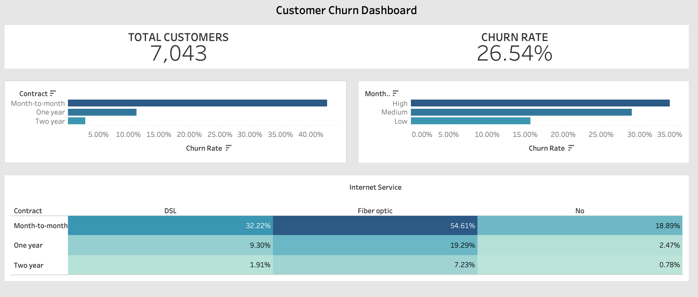

# Customer Churn Dashboard (Tableau)

## 📊 Project Overview
This interactive dashboard analyzes customer churn behavior using contract type, pricing tiers, and internet service.

The goal is to identify key drivers of churn and provide actionable business insights.

---

## 🔍 Business Questions
- What is the overall churn rate?
- Which contract types have the highest churn?
- Does pricing level impact churn?
- How does churn vary by contract and internet service?

---

## 📈 Key Insights
- Overall churn rate: **26.54%**
- Month-to-month contracts show the highest churn (~42%)
- High monthly charge customers churn more frequently
- Fiber optic users with month-to-month contracts show the highest churn segment (54.61%)

---

## 🛠 Tools Used
- Tableau
- SQL (for data analysis and aggregation)
- Excel (data preparation)

---

## 🌐 Live Dashboard
You can view the interactive dashboard here:  
👉 [Tableau Public Link]https://public.tableau.com/app/profile/benjamin.benlulu/
---

## 🖼 Dashboard Preview

